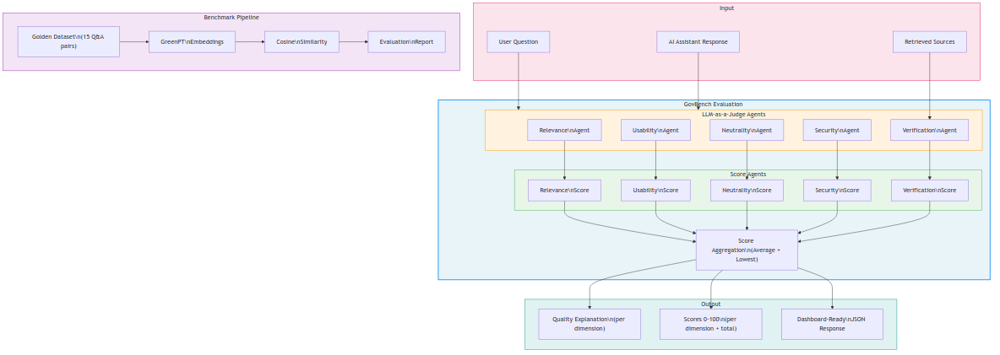

# GovBench

**A user-friendly tool to explicitly evaluate and explain the output quality of AI assistants for government use.**

> Built during the [DigiCampus Digital Assistant Quality Hackathon](https://www.digicampus.tech/) -- Challenge: *"How do we improve the quality of digital assistant output in real time?"*

---

## The Problem

Government employees increasingly rely on AI assistants for finding, interpreting, and applying policy information. But generating an answer is not enough -- the answer must be:

- **Relevant** to the specific question asked
- **Neutral** in tone, avoiding political advice
- **Safe** and compliant with ethical and policy frameworks
- **Usable** with clear, actionable next steps
- **Verifiable** with traceable source references

Without explicit quality measurement, trust erodes and adoption stalls. GovBench makes AI quality **visible, measurable, and understandable** -- even for non-technical users.

---

## How It Works

GovBench evaluates AI assistant responses across **five quality dimensions** using an **LLM-as-a-Judge** approach, combined with traditional embedding-based similarity metrics.



<details>
<summary>Text-only version (if image doesn't render)</summary>

```
                          ┌─────────────────────────────────────────────────┐
                          │                    INPUT                        │
                          │                                                 │
                          │  User Question    AI Response    Retrieved      │
                          │       │               │          Sources        │
                          └───────┼───────────────┼─────────────┼──────────┘
                                  │               │             │
                  ┌───────────────▼───────────────▼─────────────┼──────────┐
                  │          GOVBENCH EVALUATION ENGINE          │          │
                  │                                              │          │
                  │  ┌──────────────────────────────────────┐    │          │
                  │  │       LLM-as-a-Judge Agents          │    │          │
                  │  │                                      │    │          │
                  │  │  Relevance  Usability  Neutrality    │    │          │
                  │  │  Agent      Agent      Agent         │    │          │
                  │  │                                      │    │          │
                  │  │  Security   Verification ◄───────────┼────┘          │
                  │  │  Agent      Agent (+ sources)        │               │
                  │  └──────────┬───────────────────────────┘               │
                  │             │                                           │
                  │             ▼                                           │
                  │  ┌──────────────────────────────────────┐               │
                  │  │         Score Agents (0-100)         │               │
                  │  │                                      │               │
                  │  │  Relevance  Usability  Neutrality    │               │
                  │  │  Score      Score      Score         │               │
                  │  │                                      │               │
                  │  │  Security   Verification             │               │
                  │  │  Score      Score                    │               │
                  │  └──────────┬───────────────────────────┘               │
                  │             │                                           │
                  │             ▼                                           │
                  │  ┌──────────────────────────────────────┐               │
                  │  │    Score Aggregation                 │               │
                  │  │    (Average + Lowest)                │               │
                  │  └──────────┬───────────────────────────┘               │
                  └─────────────┼───────────────────────────────────────────┘
                                │
                  ┌─────────────▼───────────────────────────────────────────┐
                  │                      OUTPUT                             │
                  │                                                         │
                  │  Quality Explanation    Scores 0-100    Dashboard-Ready │
                  │  (per dimension)        (per dim+total) JSON Response   │
                  └─────────────────────────────────────────────────────────┘


 ╔══════════════════════════════════════════════════╗
 ║            BENCHMARK PIPELINE                    ║
 ║                                                  ║
 ║  Golden Dataset ──► GreenPT ──► Cosine ──► Eval  ║
 ║  (15 Q&A pairs)    Embeddings  Similarity  Report ║
 ╚══════════════════════════════════════════════════╝
```

</details>

> The full Mermaid source is in [`docs/architecture.mmd`](docs/architecture.mmd).

---

## Key Features

### LLM-as-a-Judge Evaluation

Each AI response is evaluated by **five specialized judge agents**, each with carefully crafted system prompts for the Dutch government context:

| Dimension | What It Measures | Example Criteria |
|-----------|-----------------|------------------|
| **Relevance** | Does the answer address the actual question? | Intent understanding, directness, contextual fit |
| **Usability** | Can the user act on this answer? | Action steps, plain language, scannability |
| **Neutrality** | Is the tone objective and professional? | No political advice, factual presentation |
| **Security** | Is the answer safe and ethical? | No harmful suggestions, privacy compliance |
| **Verification** | Can claims be traced to sources? | Source references, accuracy of citations |

Each judge produces:
1. A **qualitative explanation** (markdown text, max 250 chars per criterion)
2. A **score from 0 to 100** with clear rubric-based guidelines

### Golden Dataset Benchmarking

A curated set of **15 questions** with ground-truth answers from [rijksoverheid.nl](https://www.rijksoverheid.nl) VAC (Frequently Asked Questions) pages, spanning two domains:

| Dataset | Questions | Domain |
|---------|-----------|--------|
| `bzk_pilot` | 10 | Ministerie van Buitenlandse Zaken (BZK) -- Woo, DigiD, BRP, elections |
| `omgevingswet` | 5 | Environment and Planning Act (Omgevingswet) |

### Embedding-Based Similarity

Responses are compared against ground truth using **GreenPT embeddings** (EU-hosted, privacy-first) and cosine similarity, producing objective similarity scores.

---

## Architecture

GovBench consists of two main components:

### 1. Real-Time Evaluation API (integrated with Theon)

The evaluation agents are designed to plug into **Theon**, our internal AI assistant platform. When a user asks a question, GovBench can evaluate the response in real-time via the `/generate_evaluation` endpoint.

> **Note:** Theon is not part of this repository. API calls to Theon (e.g., in `evaluate_api.sh`) reference our full internal platform. This repo contains the evaluation logic that powers quality measurement.

### 2. Standalone Benchmark Pipeline

Run evaluations independently against any AI assistant using the scripts in `llm-eval/`.

---

## Repository Structure

```
govbench/
├── README.md                              # You are here
├── .gitignore
│
├── eval_verification_agent.py             # LLM-as-a-Judge agents (5 dimensions)
├── agent_template.py                      # Agent execution framework with retry logic
├── router.py                              # FastAPI evaluation endpoints
├── schemas.py                             # Pydantic request/response models
├── services.py                            # Evaluation orchestration service
│
├── dataset/                               # Golden evaluation dataset
│   ├── evaluation_dataset.json            # 15 questions with ground truth
│   ├── evaluation_dataset.jsonl           # Same dataset, JSONL format
│   ├── evaluation_dataset.csv             # Questions only (CSV)
│   ├── load_evaluation_dataset.py         # Dataset loader (RAGAS/TruLens/LangChain)
│   ├── list_of_subjects.md               # Rijksoverheid subject categories
│   ├── rijksoverheid_vacs_bzk.md/.csv     # 175 BZK reference Q&A pairs
│   ├── rijksoverheid_vacs_omgevingswet.*  # 5 Omgevingswet reference Q&A pairs
│   ├── cache_vacs/                        # Raw API cache (Omgevingswet)
│   ├── cache_vacs_bzk/                    # Raw API cache (BZK)
│   └── rag_sources/                       # RAG source configuration & scraping
│       ├── sources_pilot.yaml             # URL-to-question mapping
│       ├── scrape_sources_to_server.py    # Web scraper
│       ├── split_markdown_by_heading.py   # Markdown chunker
│       └── validate_sources.py            # YAML source validator
│
└── llm-eval/                              # Standalone evaluation pipeline
    ├── evaluate_pipeline.py               # Cosine similarity evaluation
    ├── evaluate_api.sh                    # Theon API evaluation script
    ├── evaluate_ragas.py                  # RAGAS metrics (WIP)
    ├── evaluate_trulens.py                # TruLens evaluation (WIP)
    ├── run_evaluation.sh                  # Main evaluation runner
    ├── requirements.txt                   # Python dependencies
    └── evaluation_results/                # Generated reports
        └── COMPARISON_REPORT.md           # Sample results report
```

---

## LLM-as-a-Judge: Deep Dive

The core of GovBench is `eval_verification_agent.py`, which implements five specialized evaluation agents. Here is how the evaluation flow works:

### Two-Step Evaluation Pattern

Each quality dimension follows the same pattern:

```
Step 1: Qualitative Analysis    ->    "The answer partially addresses the question
        (eval_*_agent)                 but misses the appeal deadline..."

Step 2: Numeric Scoring         ->    72
        (eval_*_score_agent)
```

**Step 1** generates a textual evaluation using dimension-specific criteria. **Step 2** converts that evaluation into a 0-100 score using rubric-based scoring guidelines.

### Scoring Rubrics

Each dimension has calibrated scoring guidelines. For example, **Relevance**:

| Score | Meaning |
|-------|---------|
| **100** | Directly and precisely answers the core question. No filler text. |
| **75** | Correct and relevant, but contains minor redundancy. |
| **50** | Touches the essence but is partially off-topic or too vague. |
| **25** | Only fragments of relevant information; focus is on side issues. |
| **0** | Completely ignores the core question. |

### Verification Agent (Source Checking)

The **Verification Agent** is unique -- it also receives the retrieved sources alongside the question and answer, enabling it to check whether claims in the response are actually supported by the cited sources.

### Score Aggregation

After all five dimensions are scored, GovBench produces two aggregate metrics:

| Metric | Calculation | Purpose |
|--------|-------------|---------|
| **Total Score** | Average of all 5 dimension scores | Overall quality indicator |
| **Lowest Score** | Minimum of all 5 dimension scores | Quality floor / weakest-link indicator |

The **lowest score** is particularly useful in a government context: even if four dimensions score 90+, a single dimension scoring 20 (e.g., missing source references) signals a critical quality gap that needs attention.

### Per-Message Audit Trail

When integrated with Theon, each evaluation result is **stored directly on the chat message** it belongs to. This means every AI response carries its quality assessment as a permanent audit trail -- enabling historical quality tracking, compliance reporting, and trend analysis across conversations.

### Agent Framework & Robustness

All evaluation agents are built on a shared agent framework (`agent_template.py`) that provides:

- **Automatic retry logic** with configurable retries and exponential backoff
- **Output validation** per type (text, percentage 0-100, boolean, JSON)
- **Think-tag stripping** to handle chain-of-thought reasoning from LLMs
- **Graceful error handling** with safe fallback values per output type

This ensures evaluation scores are reliably produced even under transient LLM failures.

---

## Getting Started

### Prerequisites

- Python 3.10+
- A GreenPT API key (EU-hosted LLM provider)

### Running the Benchmark Pipeline

```bash
cd llm-eval

# Install dependencies
pip install -r requirements.txt

# Set required environment variables
export GREENPT_API_KEY="your-greenpt-api-key"
export THEON_API_TOKEN="your-theon-token"  # Required for Theon API calls

# Run evaluation (cosine similarity)
python evaluate_pipeline.py --with-collection        # With RAG collections
python evaluate_pipeline.py --no-collection          # Baseline without collections
python evaluate_pipeline.py --with-collection --single  # Single question test

# Or use the runner script (handles both modes)
./run_evaluation.sh
./run_evaluation.sh --single  # Quick test
```

### Loading the Golden Dataset

```python
from dataset.load_evaluation_dataset import load_dataset, to_ragas_format

# Load all 15 questions
dataset = load_dataset()

# Filter by domain
bzk_only = load_dataset(dataset_filter="bzk_pilot")

# Convert for RAGAS evaluation framework
ragas_dataset = to_ragas_format(dataset)
```

### Using the Evaluation Agents

```python
from eval_verification_agent import (
    eval_relevance_agent,
    eval_relevance_score_agent,
    eval_neutrality_agent,
    eval_neutrality_score_agent,
)

# Get qualitative evaluation
relevance_text = await eval_relevance_agent(answer="...", question="...")

# Get numeric score (0-100)
relevance_score = await eval_relevance_score_agent(relevance_text)
```

---

## Sample Results

From our benchmark evaluation using cosine similarity with GreenPT embeddings:

| Metric | With Collections (RAG) | Without Collections | Improvement |
|--------|----------------------|-------------------|-------------|
| **Overall Similarity** | 0.8405 | 0.7240 | **+16.7%** |

This confirms that domain-specific knowledge bases significantly improve answer quality -- a core insight for government AI deployment.

---

## Environment Variables

| Variable | Description | Required |
|----------|-------------|----------|
| `GREENPT_API_KEY` | GreenPT API key for embeddings and LLM calls | Yes |
| `GREENPT_API_URL` | GreenPT API base URL | No (default: `https://api.greenpt.ai/v1`) |
| `THEON_API_URL` | Theon platform API URL | No (default: `http://localhost:8080`) |
| `THEON_API_TOKEN` | Bearer token for Theon API authentication | For API eval |
| `THEON_EMAIL` | Email for automatic Theon login | Alternative to token |
| `THEON_PASSWORD` | Password for automatic Theon login | Alternative to token |

---

## Design Decisions

1. **LLM-as-a-Judge over heuristics** -- Rule-based quality checks cannot capture nuance in government communication. LLM judges with domain-specific prompts provide more meaningful evaluation.

2. **Two-step evaluation** -- Separating qualitative analysis from scoring makes the evaluation explainable and auditable. Users see *why* a score was given, not just the number.

3. **Five independent dimensions** -- Rather than a single "quality" score, we measure five orthogonal aspects. This lets users identify *which specific aspect* needs improvement.

4. **Dutch government context** -- All evaluation prompts are calibrated for the Dutch government context: professional tone, no political advice, source verifiability, and citizen-facing communication standards.

5. **Privacy-first infrastructure** -- Using GreenPT (EU-hosted, open-source models) ensures compliance with government data sovereignty requirements.

---

## Hackathon Context

This project was built for the **DigiCampus Digital Assistant Quality** challenge, exploring how to help government employees use AI assistants **reliably and responsibly** by making output quality explicit, measurable, and improvable.

**Challenge owner:** Ministry of the Interior and Kingdom Relations (BZK)

---

## License

This project was created during a hackathon. Please check with the repository owner for licensing terms.
